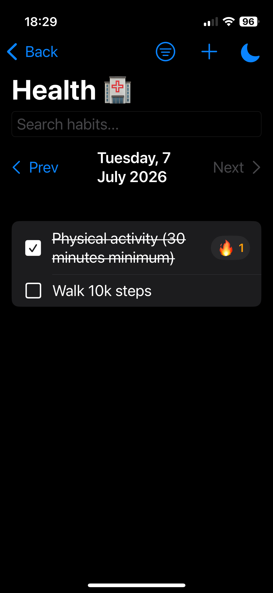
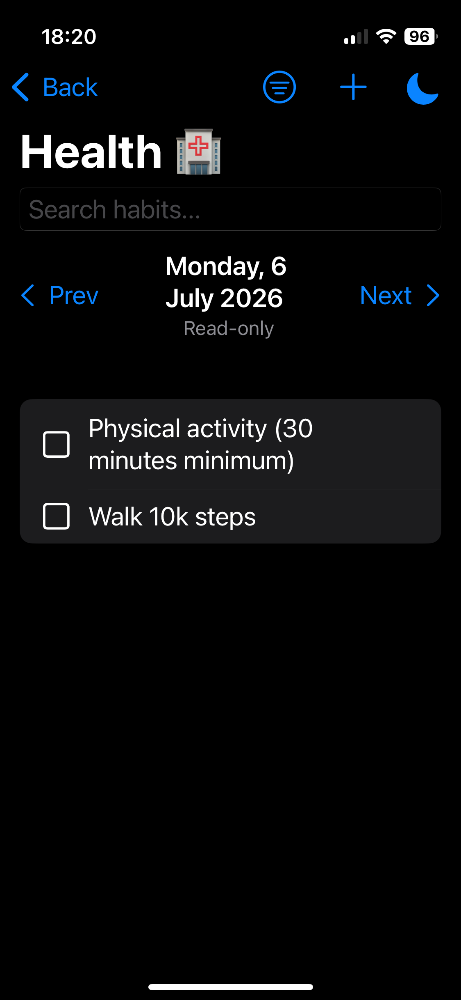
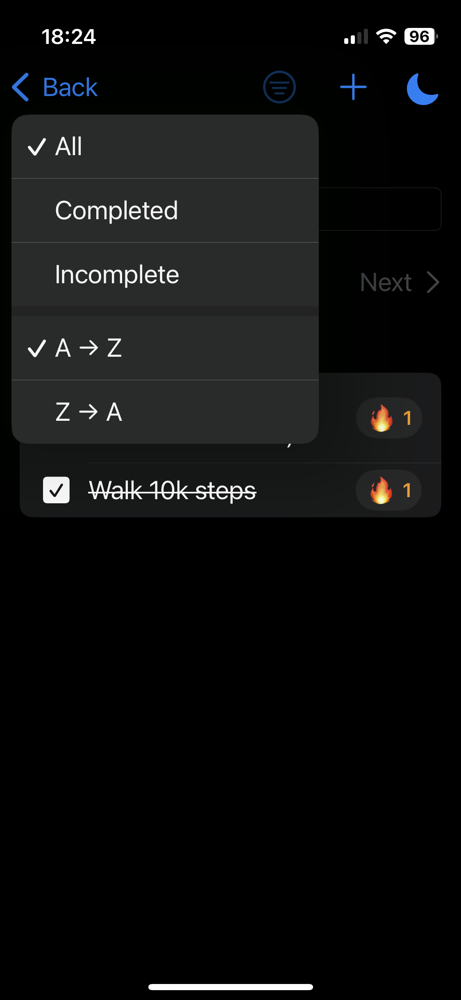
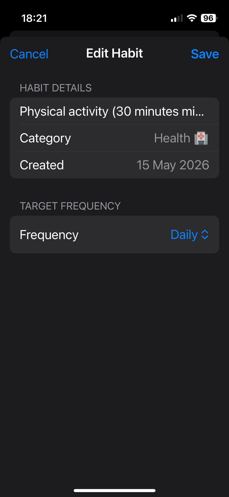
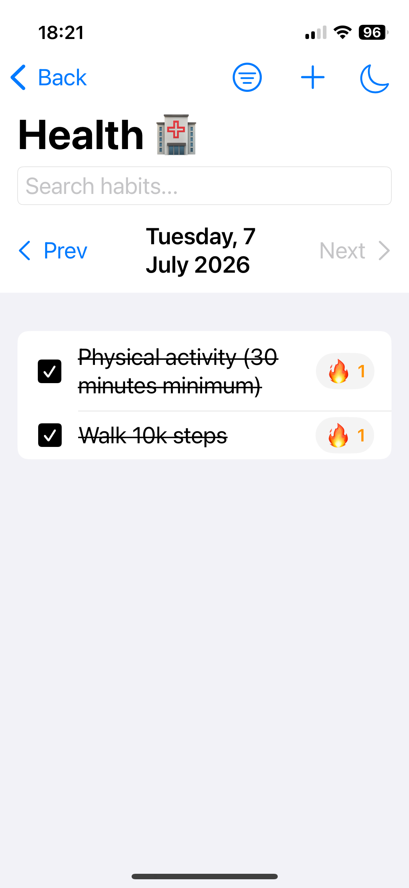

# 💪 VitalityTracker

Build habits. Track progress. Stay consistent.  
A modern iOS habit-tracking application built with SwiftUI and SwiftData.


**Kingston University — Mobile Application Development**

---

## 📖 About

VitalityTracker is an iOS habit-tracking application designed to help users organise routines, log daily progress, and stay consistent over time.

Users can create custom habit categories, add habits, mark habits as complete for specific days, view previous daily logs, and track streaks through a clean diary-style interface inspired by apps such as MyFitnessPal.

The app was developed as coursework for the Mobile Application Development module at Kingston University, demonstrating native iOS development with SwiftUI, SwiftData persistence, notification handling, reusable components, and an MVC-style project structure.

---

## ✨ Features

- ✅ **Habit Tracking** — Create, edit, complete, and delete habits
- 📂 **Custom Categories** — Organise habits into editable user-defined categories
- 📅 **Daily Diary View** — Navigate between dates to review completed habits
- 🔥 **Streak Tracking** — Consecutive completions are tracked automatically
- 🔍 **Search** — Quickly find habits within a category
- ↕️ **Sort & Filter** — Sort habits and filter by completion status
- 📝 **Edit Sheets** — Edit habit names through a dedicated sheet interface
- 👆 **Swipe Actions** — Native swipe gestures for editing and deleting
- 🌗 **Light & Dark Mode** — Toggle between system appearances
- 🔔 **Notifications** — Local reminders to stay on track
- 🧩 **Reusable Components** — Modular SwiftUI views for improved maintainability
- 📭 **Empty States** — Helpful placeholders when no categories or habits exist
- 💾 **SwiftData Persistence** — Local storage for habits, categories, and daily logs

---

## 📱 Screenshots

<p align="center">
  
  
</p>

<p align="center">
  
  
</p>

<p align="center">
  
  
</p>

---

## 🛠️ Tech Stack

| Layer | Technology |
|--------|------------|
| Language | Swift |
| UI Framework | SwiftUI |
| Persistence | SwiftData |
| Architecture | Model–View–Controller (MVC) |
| Notifications | UserNotifications |
| IDE | Xcode |
| Platform | iOS |

---

## 🏛️ Architecture

VitalityTracker follows a clean MVC-style structure, separating data models, business logic, and presentation.

```text
VitalityTracker/
├── Model/
│   ├── Category.swift
│   ├── Item.swift
│   └── DailyLog.swift
│
├── Controller/
│   ├── Main Controllers/
│   │   ├── HabitController.swift
│   │   └── CategoryController.swift
│   │
│   └── Secondary Controllers/
│       ├── NotificationController.swift
│       ├── StreaksController.swift
│       └── UIColorController.swift
│
├── View/
│   ├── ContentView.swift
│   ├── CategoryView.swift
│   ├── HabitListView.swift
│   │
│   └── Components/
│       ├── DateBar.swift
│       ├── HabitRowView.swift
│       ├── HabitSheet.swift
│       ├── SortFilterMenu.swift
│       ├── HabitSortFilter.swift
│       ├── EmptyStateView.swift
│       └── DarkModeToolbarButton.swift
│
├── Assets.xcassets/
└── VitalityTracker.swift
```

Models define the SwiftData persistence layer.

Controllers manage application state, category management, habit logic, streak calculations, notifications, and appearance settings.

Views remain focused on presentation while reusable components reduce duplication and improve maintainability.

---

## 🚀 Getting Started

### Requirements

- macOS Sonoma or later
- Xcode 16+
- iOS 18+
- Apple Developer account for running on a physical device

### Installation

Clone the repository:

```bash
git clone https://github.com/<your-username>/VitalityTracker.git
cd VitalityTracker
```

Open the project:

```bash
open VitalityTracker.xcodeproj
```

Configure Signing & Capabilities by selecting your Apple Developer Team and, if necessary, changing the Bundle Identifier.

Build and run using **⌘R**.

---

## 🔔 Permissions

| Permission | Purpose |
|------------|---------|
| Notifications | Local habit reminder support |

---

## 🧪 Development Timeline

Major milestones during development included:

- Initial habit and category management
- Daily log system
- Streak tracking
- MyFitnessPal-inspired diary interface
- Local notification support
- Habit editing and deletion
- Search, sorting, and filtering
- UI refactored into reusable SwiftUI components
- Empty states and interface polish
- Repository prepared for public release

---

## 🔮 Future Improvements

Potential future additions include:

- Weekly and monthly analytics
- Progress charts
- iCloud synchronisation
- Widget support
- Custom reminder schedules
- Habit icons and colour customisation
- Improved onboarding experience

---

## 👤 Author

| Name | Role |
|------|------|
| **Abdullah Sajid** | iOS Development, SwiftUI, SwiftData, Application Architecture |

---

## 📄 Licence

This project was created for academic purposes as part of the **Mobile Application Development** module at **Kingston University**.

Built with ☕ and SwiftUI.
