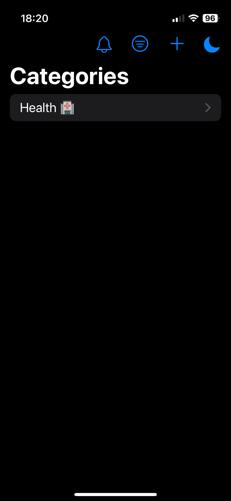

# 💪 VitalityTracker

Build habits. Track progress. Stay consistent.
A modern iOS habit-tracking app built with SwiftUI and SwiftData.


Kingston University — Mobile Application Development

---

## 📖 About

VitalityTracker is an iOS habit-tracking application designed to help users organise routines, log daily progress, and stay consistent over time.

Users can create custom habit categories, add habits, mark habits as complete for specific days, view previous daily logs, and track streaks through a clean diary-style interface inspired by apps such as MyFitnessPal.

The app was developed as coursework for the Mobile Application Development module at Kingston University, demonstrating native iOS development with SwiftUI, SwiftData persistence, notification handling, reusable components, and an MVC-style project structure.

---

## ✨ Features

✅ **Habit Tracking** — Create, edit, complete, and delete habits
📂 **Custom Categories** — Organise habits into editable user-defined categories
📅 **Daily Diary View** — Move between dates to review habits completed on different days
🔥 **Streak Tracking** — Consecutive completions are tracked and displayed with streak counts
🔍 **Search** — Quickly find habits within a category
↕️ **Sort & Filter** — Sort habits and filter by completion status
📝 **Edit Sheets** — Edit habit names through a dedicated sheet interface
👆 **Swipe Actions** — Edit and delete habits/categories using native swipe gestures
🌗 **Dark Mode** — Toggle between light and dark appearance
🔔 **Notifications** — Local notification support for habit reminders
🧩 **Reusable Components** — UI broken down into maintainable SwiftUI components
📭 **Empty States** — Helpful placeholder screens guide users when no data exists
💾 **SwiftData Persistence** — Categories, habits, and daily logs are stored locally

---

## 📱 Screenshots

Add screenshots inside a folder called:

```text
Screenshots/
```

Recommended screenshots:

| Screenshot                | What to capture                                                   |
| ------------------------- | ----------------------------------------------------------------- |
| `01-categories.png`       | The main category screen with several categories visible          |
| `02-habit-list.png`       | A category opened with multiple habits showing                    |
| `03-completed-habits.png` | Habits marked as complete, showing strikethrough/streak behaviour |
| `04-date-diary.png`       | The DateBar showing movement between different days               |
| `05-edit-habit.png`       | The habit edit sheet open                                         |
| `06-sort-filter.png`      | The sort/filter menu open                                         |
| `07-empty-state.png`      | An empty category or empty habit list state                       |
| `08-dark-mode.png`        | A clean dark mode screenshot of the main app                      |

Example layout:

```markdown
<p align="center">
  
  
  
</p>
```

---

## 🛠️ Tech Stack

| Layer         | Technology                            |
| ------------- | ------------------------------------- |
| Language      | Swift                                 |
| UI Framework  | SwiftUI                               |
| Persistence   | SwiftData                             |
| Architecture  | Model–View–Controller style structure |
| Notifications | UserNotifications                     |
| IDE           | Xcode                                 |
| Platform      | iOS                                   |

---

## 🏛️ Architecture

VitalityTracker follows a clear MVC-style structure, separating data models, state management, and SwiftUI views.

```text
VitalityTracker/
├── Model/
│   ├── Category.swift
│   ├── Item.swift
│   └── DailyLog.swift
│
├── Controller/
│   ├── Main Controllers/
│   │   ├── HabitController.swift
│   │   └── CategoryController.swift
│   │
│   └── Secondary Controllers/
│       ├── NotificationController.swift
│       ├── StreaksController.swift
│       └── UIColorController.swift
│
├── View/
│   ├── ContentView.swift
│   ├── CategoryView.swift
│   ├── HabitListView.swift
│   │
│   └── Components/
│       ├── DateBar.swift
│       ├── HabitRowView.swift
│       ├── HabitSheet.swift
│       ├── SortFilterMenu.swift
│       ├── HabitSortFilter.swift
│       ├── EmptyStateView.swift
│       └── DarkModeToolbarButton.swift
│
├── Assets.xcassets/
└── VitalityTracker.swift
```

Models define the SwiftData persistence layer. Controllers manage app state, habit logic, category logic, streak calculations, notifications, and colour mode behaviour. Views remain focused on presentation and react to state changes from controllers.

Reusable UI components are extracted into the `Components` folder to keep the main views cleaner, easier to maintain, and easier to expand.

---

## 🚀 Getting Started

### Requirements

* macOS Sonoma or later
* Xcode 16+
* iOS 18+ recommended
* Apple Developer account for running on a physical device

### Installation

Clone the repository:

```bash
git clone https://github.com/<your-username>/VitalityTracker.git
cd VitalityTracker
```

Open the project in Xcode:

```bash
open VitalityTracker.xcodeproj
```

Configure signing:

1. Select the `VitalityTracker` target
2. Open **Signing & Capabilities**
3. Select your development team
4. Change the Bundle Identifier if needed

Build and run:

```bash
⌘R
```

---

## 🔔 Permissions

VitalityTracker may request notification permission so the app can support habit reminders.

| Permission    | Purpose                               |
| ------------- | ------------------------------------- |
| Notifications | Used for local habit reminder support |

---

## 🧪 Development Timeline

The project evolved through several major milestones:

* Initial habit and category structure
* Project renamed and refined into VitalityTracker
* Daily log system implemented
* Streak tracking added
* MyFitnessPal-style diary interface introduced
* Notification support implemented
* Habit editing and deletion improved
* Sorting and filtering added
* UI refactored into reusable SwiftUI components
* Empty states and layout polish added
* Repository prepared for public release

---

## 🔮 Future Improvements

Potential future additions include:

* Custom reminder times per habit
* Habit statistics and weekly/monthly progress charts
* iCloud sync
* Onboarding flow for first-time users
* More customisation for categories and habit icons
* Widget support
* Improved analytics for long-term habit consistency

---

## 👤 Author

| Name           | Role                                                  |
| -------------- | ----------------------------------------------------- |
| Abdullah Sajid | iOS Development, SwiftUI, SwiftData, App Architecture |

---

## 📄 Licence

This project was created for academic purposes as part of the Mobile Application Development module at Kingston University.

Built with ☕ and SwiftUI.
